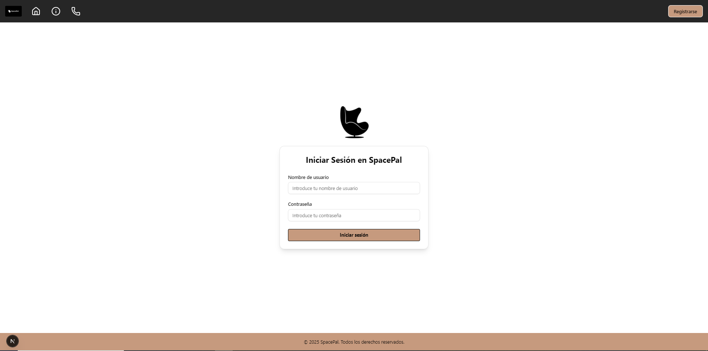
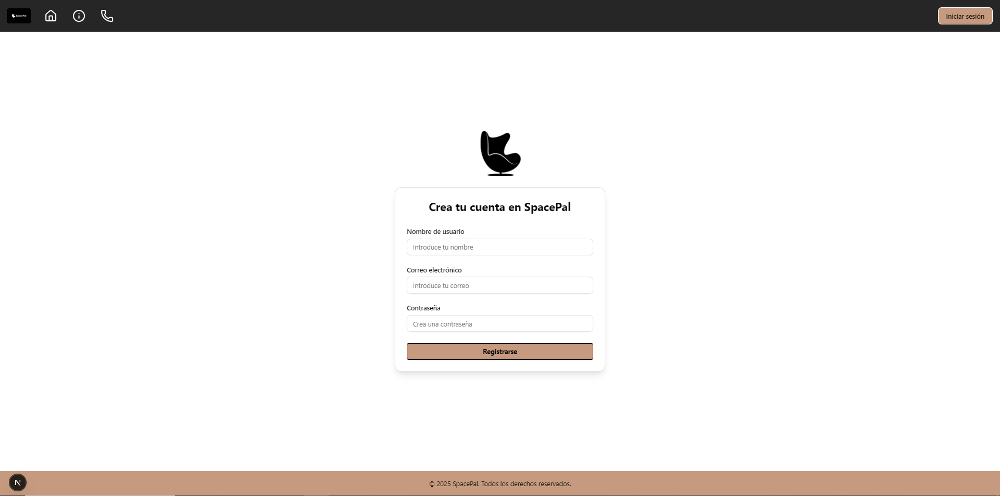
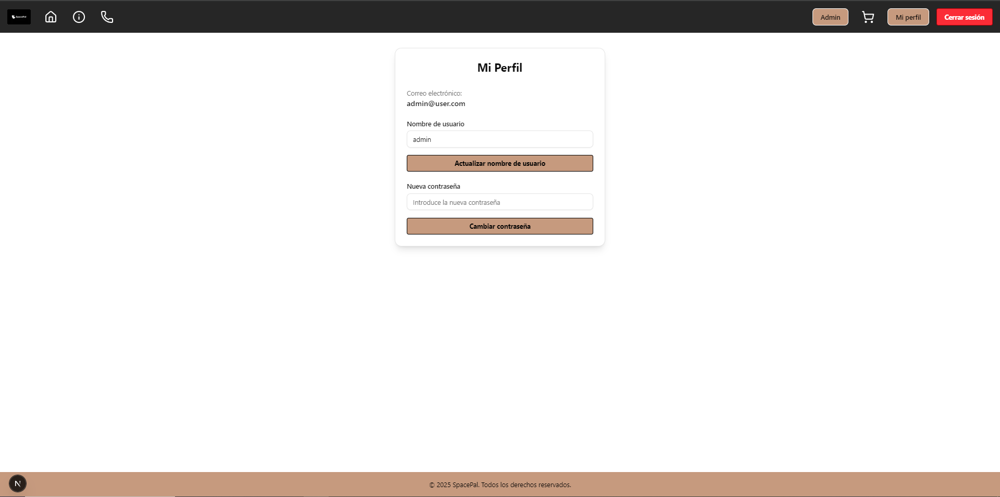
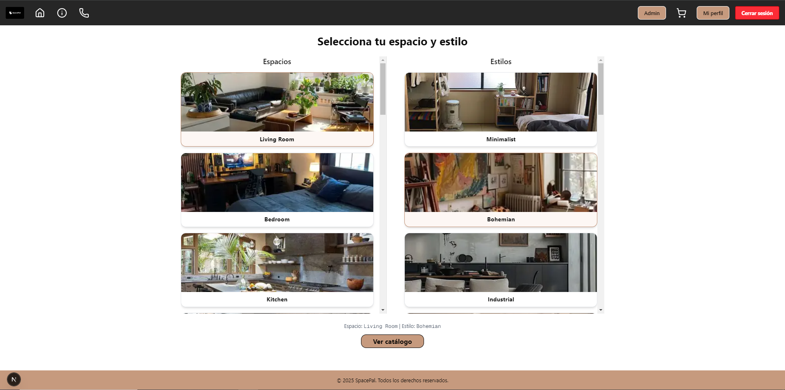
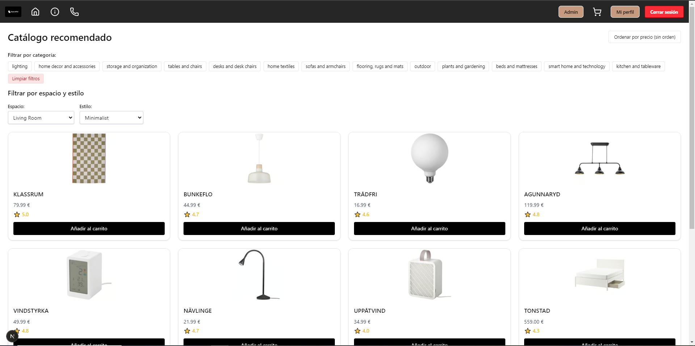
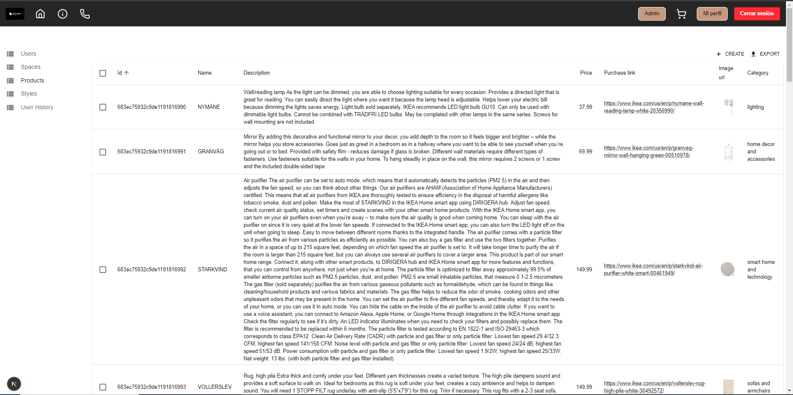
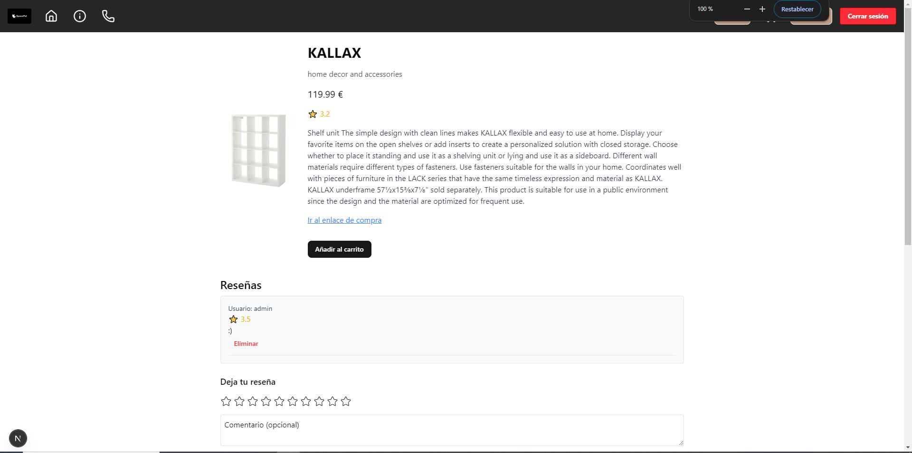
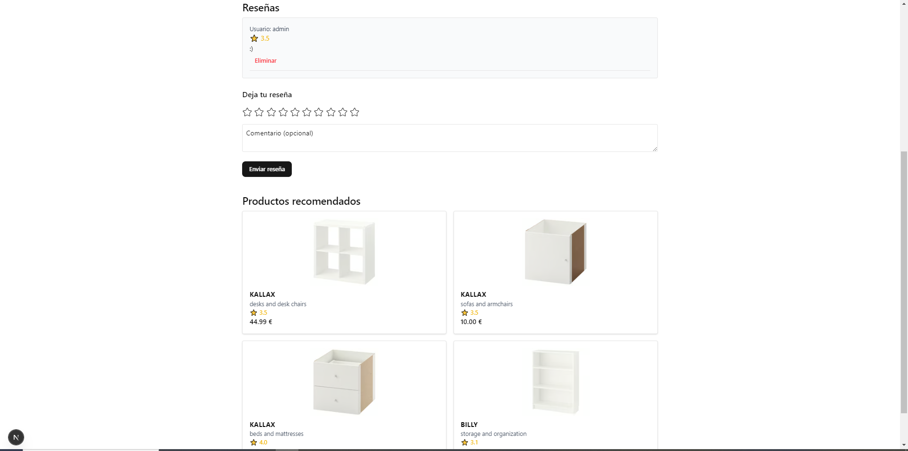

# 🏠 SpacePal

Una aplicación web para recomendaciones de decoración de interiores utilizando inteligencia artificial.

---

## 👤 Alumno y Tutor

- **Alumno**: Marcos García Moreno  
- **Tutor**: Andrés Redchuk Cisterna

---

## 🔗 Enlaces

- **Tablero de GitHub Project**: [Enlace al proyecto](https://github.com/users/garmo17/projects/1)

---

## ✅ Funcionalidades

### Funcionalidades Básicas
- Registro e inicio de sesión de usuarios
- Funcionalidad de carrito de la compra

### Funcionalidades Avanzadas
- Recomendaciones personalizadas de productos basadas en el historial del usuario
- Productos sugeridos en función del producto actualmente visualizado
- Sistema de valoraciones y reseñas
- Panel de administración con control total de los datos
- Clasificación de productos mediante embeddings generados por un transformer

---

## 🔍 Descripción Detallada de Funcionalidades

### 📚 Entidades
- **Usuario**
- **Estilo**
- **Espacio**
- **Producto**
- **Historial de Usuario**

**Relaciones:**
- Un **producto** pertenece a varios estilos y espacios.
- Un **historial de usuario** está vinculado a un único usuario y un único producto.

### 🔐 Permisos de Usuarios
- **Usuario Normal**:
  - Puede registrarse, iniciar sesión y modificar su perfil.
  - Puede ver y valorar productos.
  - Puede acceder a estilos y espacios.
  - Puede generar entradas en su historial.
- **Usuario Administrador**:
  - Acceso completo de lectura, escritura, edición y borrado en todas las entidades.
  - La distinción se hace a través del campo `username`.

### 🖼️ Imágenes
- Entidades con imágenes asociadas:
  - **Estilo** (1 imagen)
  - **Espacio** (1 imagen)

### 📊 Gráficos
- La aplicación no incluye visualización de datos mediante gráficos.

### 🛠️ Tecnologías Complementarias
- **Frontend**:
  - **Next.js** con **React**, **TypeScript**, **JSX**, **TailwindCSS**, **shadcn/ui**, **react-admin**, **toast**
- **Backend**:
  - **FastAPI**
  - **MongoDB**
  - **OAuth2** para autenticación
  - **JWT** para gestión de tokens
  - **Pydantic** para validación de datos
- **Inteligencia Artificial**:
  - Embeddings de texto para representación y clasificación de productos
  - Similaridad por coseno para lógica de recomendación
  - Transformer LLM para vectorizar con contexto

### 🧠 Algoritmo o Consulta Avanzada
- **Recomendaciones personalizadas**: se calcula la media de los vectores de los productos que el usuario ha visto o guardado (historial), y se comparan mediante similaridad de coseno con los productos disponibles. Se aplica una fórmula ponderada: 70% por similitud de embeddings, 30% por valoraciones del producto.
- **Sugerencias basadas en producto**: productos similares obtenidos comparando los vectores del producto actual con otros, utilizando frecuencias de palabras.
- **Clasificación automática**: los productos son clasificados en estilos, espacios y categorías mediante un modelo tipo transformer que genera los vectores de embedding.

---

## 📍 Wireframes y Navegación

### Flujo de Navegación
1. Ingresar a la app (no es obligatorio iniciar sesión)
2. Pulsar en \"Comenzar\" para acceder a la **pantalla de selección de estilo y espacio**
3. Visualizar el **catálogo** con recomendaciones:
   - Si estás **logueado**: recomendaciones personalizadas según tu historial
   - Si **no estás logueado**: recomendaciones según valoraciones de otros usuarios
4. Hacer clic en un producto para ver sus detalles y sugerencias similares
5. Añadir productos al **carrito de la compra**
6. Acceder al **perfil de usuario** o **panel de administrador**, según corresponda

---

## 🧭 Wireframe de Pantallas y Navegación

A continuación se muestran los wireframes que representan las distintas pantallas y el flujo de navegación de la aplicación **SpacePal**:

### 🏁 Pantalla de Inicio
  
Pantalla principal con acceso a navegación general y botón de "Comenzar".

### 🔑 Login
  
Pantalla para el inicio de sesión del usuario.

### 📝 Registro
  
Pantalla para que nuevos usuarios creen una cuenta.

### 👤 Perfil de Usuario
  
Gestión del perfil del usuario registrado.

### 🎨 Selección de Estilo y Espacio
  
Permite al usuario elegir un estilo de decoración y un tipo de espacio.

### 🛍️ Catálogo de Productos
  
Visualización de los productos recomendados, ya sea por historial o popularidad.

### 🛠️ Panel de Administración
  
Acceso exclusivo para usuarios administradores para gestionar datos del sistema.

### 🛒 Carrito de Compra
  
Muestra los productos añadidos para realizar la compra.

### ⭐ Detalle de Producto
  
Pantalla que muestra información detallada del producto.

### 🎯 Productos Recomendados
  
Sugerencias de productos similares al visualizado.

---

### 🔁 Flujo de navegación

1. Pantalla de inicio ➡️ Selección de estilo/espacio  
2. Selección ➡️ Catálogo de productos  
3. Desde el catálogo ➡️ Detalles del producto o añadir al carrito  
4. Usuario puede ir al perfil o al panel admin según rol

---

_Este archivo README ha sido creado como parte del Trabajo de Fin de Grado (TFG) del proyecto: SpacePal._
